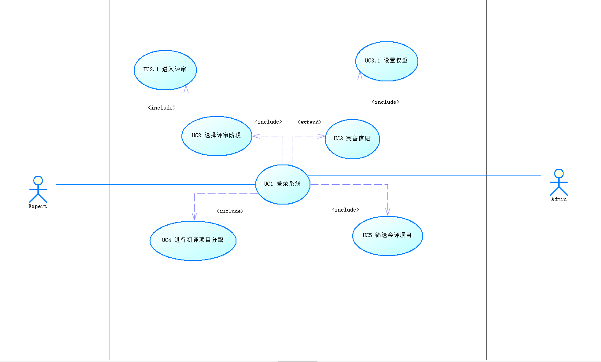

# EvaluationSystem
课程作业——评审系统

# 需求文档
## 1. 项目简介  
本项目是可以满足各类项目在线评分评审需求的系统，如评审学生作业、评审投标项目等等。该系统根据用户对象，将功能分为管理员模块和专家模块。主要功能分为管理员与专家两个方面，管理员有登录，核查项目分数，为专家分配项目等功能。专家有登录，完善个人信息，为项目打分，为终评项目投票等功能。  
## 2. 需求分析
### 2.1 专家需求
	2.1.1 专家登录  
		专家通过账号密码登录系统  
	2.1.2 完善个人信息  
		专家首次登录时，需要完善职称，部门等个人信息  
	2.1.3 完善指标权重  
		专家首次登录，需设置各个指标的权重，综合各个专家设置的权重，然后结合初始权重得出一个更加合理的权重，使得评审更加公正合理。  
	2.1.4 选择评审阶段  
		根据当前的评审阶段，选择正确的评审界面  
	2.1.5 保存初评项目成绩  
		专家在评审完所有项目之后，需要对系统进行一次成绩提交，提交之后，成绩将不能再修改。  
	2.1.6 搜索项目  
		由于每一个专家分配的项目较多，我们需要设置一个搜索框，专家可以通过项目名称直接搜索对应项目。  
	2.1.7 项目筛选  
		专家有时需要对同一类型项目进行对照，设置一个筛选栏可以让专家很快的筛选出同一类的项目。  
	2.1.8 进入评审页面  
		专家在浏览项目大概信息之后需要进入评审页面，对每一个项目进行细致的打分。  
	2.1.9 设置总体印象分  
		根据每一个项目提供的信息，各个指标的完善程度，给出对该项目的第一印象分。  
	2.1.10 指标打分  
		对每一个项目具体的指标进行打分  
	2.1.11 项目之间跳转  
		也许在给某一个项目打分的过程中，想参照其他项目进行打分，需要在项目之间进行跳转。  
	2.1.12 对会评价项目进行投票  
		在浏览该类型所有会评项目之后，并且进行评价，专家可以对会评项目进行投票，选出其中最优秀的一个或者多个项目。  
	2.1.13 查看会评项目信息   
		点击查看会评项目信息之后可以进入项目界面，并且有该项目的初评成绩雷达图，以便专家进行评估。  
### 2.2 管理员需求
	2.2.1 管理员登录
		选择管理员登录之后，利用管理员的账号密码进行登录。
	2.2.2 查询项目信息
		和专家页面类似，管理员也需要对某一个或者某一类项目进行查询。
	2.2.3 项目排序
		依照项目成绩对项目进行排序，以便对项目有总体直观的感受
	2.2.4 初评项目分配——自动分配
		当如所有项目之后，根据项目类型以及专家类型进行相应的分配，保证每一个专家分配的项目数量较为均匀，每一个项目都有5个专家对其进行评审。
	2.2.5 初评项目分配——手动分配
		手动对某一个项目或者专家进行分配，比如该次评审过程中有一个专家因为身体原因，甲方要求给该专家分配10-20个项目，不能过多，我们最终采取手动分配的方法，给该专家分配了10个项目。
	2.2.6 筛选初评项目进入会评
		依照会评时的成绩，筛选出每一类的前40%项目进入会评。
	2.2.7 导出项目信息
		将各个阶段的项目信息整合成Excel，并且提供下载
	2.2.8 修改各个项目获奖情况
		根据项目的成绩，给不同项目不同的奖项  
## 3. 用例图
### 3.1 用例图

### 3.2 用例图描述

| 执行者 |    用例名    |                  描述                  |    前置条件    | 结束状况 | 说明 |
| :----: | :----------: | :----------------------------------------: | :----: | :----: | :----: |
|  用户  |   登录系统   | 用户通过选择不同的登录界面决定是管理员登录还是专家登录，然后输入账号与密码进行登录 |用户输入正确的账号密码 |进入专家页面或者管理员页面 |账号密码错误，无法登录。首次登录跳转到完善信息页面 |
