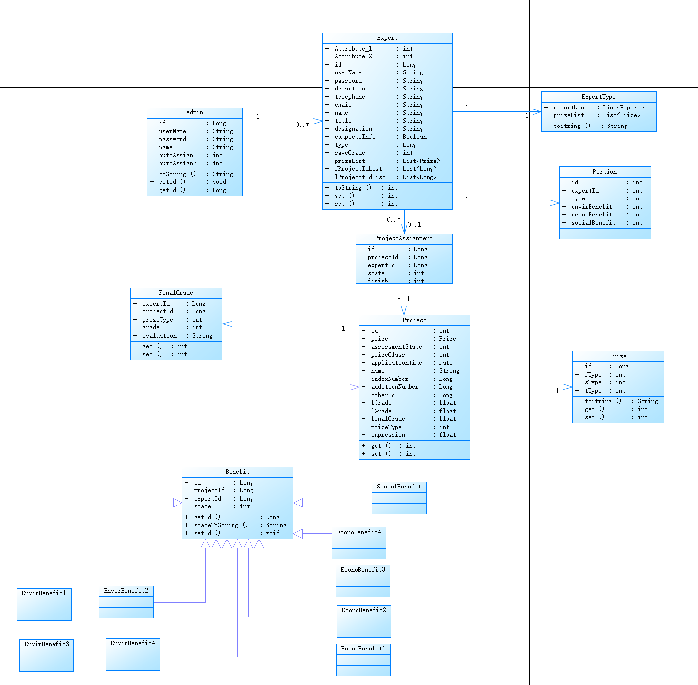

# 功能设计
## 类图
   首先对整个项目进行需求分析，然后进行类的抽取，一方面从系统的使用者角度来看，我们需要专家与管理员两个类。其次从项目的角度来看，项目本身构成一个类，奖项也是一个类。这些是整个评审系统所需要的实体类，然后就是考虑控制类，专家具有不同类型，所以需要抽取专家类型作为一个类，同样的奖项也需要抽取奖项类型作为一个类。项目具有不同类型抽取出效益类从而对项目进行分类，而且效益具有很多不同的属性，所以有很多子类。
   

## 接口设计
### 1、登录
    请求方法：post
    请求路径：/admin/login
请求参数：   
| 字段        | 说明        | 类型          |备注	|是否必填|
| :---        |    :----:   |       :----:  |   :----: |  :---: |
| username |用户名   | string      | 	用户名称|是      |
| password  | 密码       |string      |密码|是|

返回参数：
| 字段        | 说明        | 类型          |备注	|是否必填|
| :---        |    :----:   |       :----:  |   :----: |   :---: |
| success	|  | 	bool	1：成功；false：不成功|  | 	是| 
| errMsg	|  | 	int	-1：出现异常；null：成功|  | 	是| 
|name	|专家名称	|string	|	|否|
|id|	用户id	|string	|	|否|

### 2、获得未分配项目
    请求方法：GET
    请求路径：/admin/get_projects_unassigned/{state}
请求参数：
| 字段        | 说明        | 类型          |备注	|是否必填|
| :---        |    :----:   |       :----:  |   :----: |    :---: |
|state	|项目状态|	int	1：初评；2：会评；3：终评|	|是|

返回参数：
| 字段        | 说明        | 类型          |备注	|是否必填|
| :---        |    :----:   |       :----:  |   :----: |   :---:|
| success	|  | 	bool	1：成功；false：不成功|  | 	是| 
| errMsg	|  | 	int	-1：出现异常；null：成功|  | 	是| 

### 3、手动分配项目 
    请求方法：POST
    请求路径：/admin/assign
请求参数：
| 字段        | 说明        | 类型          |备注	|是否必填|
| :---        |    :----:   |       :----:  |   :----: |   :---:|
| state	| 项目状态	| int	1：初评；2：会评；3：终评| |	是| 
| expertId	| 专家id	| string	| 	|是| 

返回参数：
| 字段        | 说明        | 类型          |备注	|是否必填|
| :---        |    :----:   |       :----:  |   :----: |    :---: |
| success	|  | 	bool	1：成功；false：不成功|  | 	是| 
| errMsg	|  | 	int	-1：出现异常；null：成功|  | 	是| 

### 4、自动分配项目 
    请求方法：POST
    请求路径：/admin/auto_assign
请求参数：
| 字段        | 说明        | 类型          |备注	|是否必填|
| :---        |    :----:   |       :----:  |   :----: |   :---: |
|state	|项目状态	|int	1：初评；2：会评；3：终评|	|是|
|expertId	|专家id|	string	|	|是|

返回参数：
| 字段        | 说明        | 类型          |备注	|是否必填|
| :---        |    :----:   |       :----:  |   :----: |   :---: |
| success	|  | 	bool	1：成功；false：不成功|  | 	是| 
| errMsg	|  | 	int	-1：出现异常；null：成功|  | 	是| 
### 5、取消分配 
    请求方法：POST
    请求路径：/admin/withdraw_assign
请求参数：
| 字段        | 说明        | 类型          |备注	|是否必填|
| :---        |    :----:   |       :----:  |   :----: |  :---:|
|state	|项目状态|	int	1：初评；2：会评；3：终评 | |	是|
|expertId|	专家id	|string	|	|是|
|projectId	|项目ID	|string	|	|是|

返回参数：
| 字段        | 说明        | 类型          |备注	|是否必填|
| :---        |    :----:   |       :----:  |   :----: |    :---: |
| success	|  | 	bool	1：成功；false：不成功|  | 	是| 
| errMsg	|  | 	int	-1：出现异常；null：成功|  | 	是| 

### 6、挑选项目
    请求方法：POST
    请求路径：/admin/select
请求参数：
| 字段        | 说明        | 类型          |备注	|是否必填|
| :---        |    :----:   |       :----:  |   :----: |    :---: |
|state	|项目状态|	int	1：初评；2：会评；3：终评| |	是|

返回参数：
| 字段        | 说明        | 类型          |备注	|是否必填|
| :---        |    :----:   |       :----:  |   :----: |     :---: |
| success	|  | 	bool	1：成功；false：不成功|  | 	是| 
| errMsg	|  | 	int	-1：出现异常；null：成功|  | 	是| 
|errProjectName	|出错项目名称| 	string	| |	是|

### 7、修改第一类项目成绩
    请求方法：POST
    请求路径：/admin/alter_grade_type1
请求参数：
| 字段        | 说明        | 类型          |备注	|是否必填|
| :---        |    :----:   |       :----:  |   :----: |   :---:|
|projectId	|项目ID	|string	| |	是|
|F_SaveLands	|节地与室外环境|	float	|项目评分指标之一	|是|
|F_SaveEnergy	|节能与能源利用|	float|	项目评分指标之一|	是|
|grade	|成绩	|float	| |	是|

返回参数：
| 字段        | 说明        | 类型          |备注	|是否必填|
| :---        |    :----:   |       :----:  |   :----: |    :---: |
| success	|  | 	bool	1：成功；false：不成功|  | 	是| 
| errMsg	|  | 	int	-1：出现异常；null：成功|  | 	是| 

### 8、修改第二类项目成绩
    请求方法：POST
    请求路径：/admin/alter_grade_type2
请求参数：
| 字段        | 说明        | 类型          |备注	|是否必填|
| :---        |    :----:   |       :----:  |   :----: |     :---: |
|projectId	|项目ID	|string		| |是|
|F_Innovation	|创新项评价|	float	|项目评分指标之一	|是|
|F_Humanity	|人文	|float	|项目评分指标之一|	是|
|grade	|成绩	|float	 ||	是|

返回参数：
| 字段        | 说明        | 类型          |备注	|是否必填|
| :---        |    :----:   |       :----:  |   :----: |     :---: |
| success	|  | 	bool	1：成功；false：不成功|  | 	是| 
| errMsg	|  | 	int	-1：出现异常；null：成功|  | 	是| 

### 9、修改第三类项目成绩
    请求方法：POST
    请求路径：/admin/alter_grade_type3
请求参数：
| 字段        | 说明        | 类型          |备注	|是否必填|
| :---        |    :----:   |       :----:  |   :----: |     :---: |
|projectId	|项目ID	|string	| |	是|
|F_Innovation	|创新项评价|	float	|项目评分指标之一	|是|
|F_Humanity	|人文	|float	|项目评分指标之一|	是|
|grade	|成绩	|float	| |	是|

返回参数：
| 字段        | 说明        | 类型          |备注	|是否必填|
| :---        |    :----:   |       :----:  |   :----: |     :---: |
| success	|  | 	bool	1：成功；false：不成功|  | 	是| 
| errMsg	|  | 	int	-1：出现异常；null：成功|  | 	是| 

### 10、修改第四类项目成绩
    请求方法：POST
    请求路径：/admin/alter_grade_type4
请求参数：
| 字段        | 说明        | 类型          |备注	|是否必填|
| :---        |    :----:   |       :----:  |   :----: |     :---: |
| projectId	| 项目ID| 	string	|  | 	是| 
| F_AssetPlan	| 资产规划	| float| 	项目评分指标之一| 	是| 
| F_AssetManagerment| 	资产运营| 	float	| 项目评分指标之一| 	是| 
| grade| 	成绩| 	float	| 	|是|

返回参数：
| 字段        | 说明        | 类型          |备注	|是否必填|
| :---        |    :----:   |       :----:  |   :----: |     :---: |
| success	|  | 	bool	1：成功；false：不成功|  | 	是| 
| errMsg	|  | 	int	-1：出现异常；null：成功|  | 	是| 

### 11、评奖
    请求方法：POST
    请求路径：/admin/award
请求参数：
| 字段        | 说明        | 类型          |备注	|是否必填|
| :---        |    :----:   |       :----:  |   :----: |     :---: |
| projectId	| 项目ID	| string|  | 		是| 
| prize	| 奖项| 	int	奖项类型|  | 	是| 

返回参数：
| 字段        | 说明        | 类型          |备注	|是否必填|
| :---        |    :----:   |       :----:  |   :----: |     :---: |
| success	|  | 	bool	1：成功；false：不成功|  | 	是| 
| errMsg	|  | 	int	-1：出现异常；null：成功|  | 	是| 

### 12、获取所有专家
    请求方法：GET
    请求路径：/admin/get_all_experts
请求参数：
| 字段        | 说明        | 类型          |备注	|是否必填|
| :---        |    :----:   |       :----:  |   :----: |     :---: |
|无| | | |	|

返回参数：
| 字段        | 说明        | 类型          |备注	|是否必填|
| :---        |    :----:   |       :----:  |   :----: |     :---: |
| success	|  | 	bool	1：成功；false：不成功|  | 	是| 
| errMsg	|  | 	int	-1：出现异常；null：成功|  | 	是| 
|experts	|所有专家|	list	| |	否|

### 13、获取所有项目
    请求方法：GET
    请求路径：/admin/get_all_projects
请求参数：
| 字段        | 说明        | 类型          |备注	|是否必填|
| :---        |    :----:   |       :----:  |   :----: |     :---: |
|无|	|	|	|	|

返回参数：
| 字段        | 说明        | 类型          |备注	|是否必填|
| :---        |    :----:   |       :----:  |   :----: |     :---: | 
| success	|  | 	bool	1：成功；false：不成功|  | 	是| 
| errMsg	|  | 	int	-1：出现异常；null：成功|  | 	是| 
|autoAssign1	|自动分配|	int	自动分配的第一个专家| |	否|
|autoAssign2	|自动分配|	int	自动分配的第二个专家| |	否|
|projects	|所有项目	|list| |		否|

### 14、获取项目分配状态
    请求方法：GET
    请求路径：/admin/get_project_assessment_state/{state}/{projectId}
请求参数：
| 字段        | 说明        | 类型          |备注	|是否必填|
| :---        |    :----:   |       :----:  |   :----: |     :---: |
|state	|项目状态|	int	1：初评；2：会评；3：终评	| |是|
|projectId	|项目ID	|string	| |	是|

返回参数：
| 字段        | 说明        | 类型          |备注	|是否必填|
| :---        |    :----:   |       :----:  |   :----: |     :---: | 
| success	|  | 	bool	1：成功；false：不成功|  | 	是| 
| errMsg	|  | 	int	-1：出现异常；null：成功|  | 	是| 
|expertNameList	|专家名称列表|	list| |		否|

### 15、查询项目平均成绩
    请求方法：GET
    请求路径：/admin/get_project_avg_grade/{type}/{projectId}/{state}
请求参数：
| 字段        | 说明        | 类型          |备注	|是否必填|
| :---        |    :----:   |       :----:  |   :----: |     :---: |
|state	|项目状态	|int	1：初评；2：会评；3：终评	| |是|
|projectId	|项目ID|	string	| |	是|
|type	|项目种类	|int	|1-4四个种类|	是|

返回参数：
| 字段        | 说明        | 类型          |备注	|是否必填|
| :---        |    :----:   |       :----:  |   :----: |     :---: | 
| success	|  | 	bool	1：成功；false：不成功|  | 	是| 
| errMsg	|  | 	int	-1：出现异常；null：成功|  | 	是| 
|F_AssetPlan	|资产规划	|float	|项目评分指标之一	|是|
|F_AssetManagerment|	资产运营|	float	|项目评分指标之一|	是|
|grade	|成绩|	float	| |	是|

### 16、获得未开始评审项目专家
    请求方法：GET
    请求路径：/admin/get_not_beginning_experts/{state}
请求参数：
| 字段        | 说明        | 类型          |备注	|是否必填|
| :---        |    :----:   |       :----:  |   :----: |     :---: |
|state|	项目状态|	int	1：初评；2：会评；3：终评| |	是|

返回参数：
| 字段        | 说明        | 类型          |备注	|是否必填|
| :---        |    :----:   |       :----:  |   :----: |     :---: | 
| success	|  | 	bool	1：成功；false：不成功|  | 	是| 
| errMsg	|  | 	int	-1：出现异常；null：成功|  | 	是| 
|experts	|未参评专家|	list	| |	否|

### 17、获得每个专家评审进度
    请求方法：GET
    请求路径：/admin/get_completion_status/{state}
请求参数：
| 字段        | 说明        | 类型          |备注	|是否必填|
| :---        |    :----:   |       :----:  |   :----: |     :---: |
|state	|项目状态|	int	1：初评；2：会评；3：终评	| |是|

返回参数：
| 字段        | 说明        | 类型          |备注	|是否必填|
| :---        |    :----:   |       :----:  |   :----: |     :---: |
| success	|  | 	bool	1：成功；false：不成功|  | 	是| 
| errMsg	|  | 	int	-1：出现异常；null：成功|  | 	是| 
|status	|所有项目状态	|list	| |	否|

