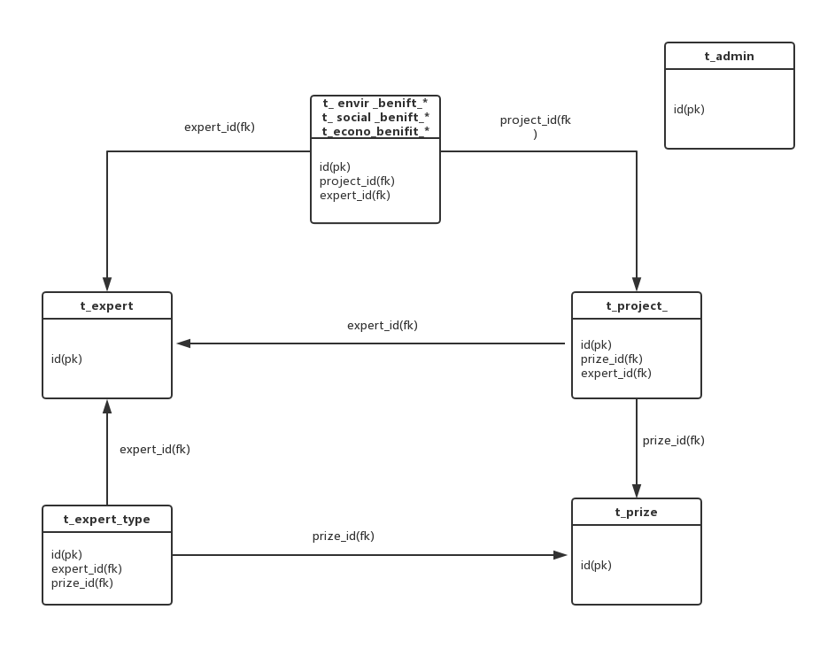

# 数据库设计
## 1. 命名规范  
### 1.1 表名
表名小写，采用下划线命名法，统一以t_前缀开头，例：t_user，t_project_assigned等
### 1.2 字段
字段小写，采用下划线命名法，例：user_name，pre_assessment_state等
### 1.3 约束名
表约束小写，采用下换线命名法。命名按照“类型_表名_字段”，类型包括主键（pk）、外键（fk）、Check约束（ck）和默认值约束（dk），例如主键pk_id，外键fk_expert_id等
### 1.4 索引 触发器 存储过程 视图等
按照一般规定进行设计

## 2. 数据库结构图 

## 3. 实体表 
### 3.1 评审专家表t_expert
| 字段 | 类型 | 大小 | 约束 | 说明 |
| --- | --- | --- | --- | --- |
| **id** | **int** | **4** | **Primary Key** | **自动编号** |
| user\_name | varchar | 50 | 　 | 专家用户名 |
| password | varchar | 50 | 　 | 专家密码 |
| department | varchar | 50 | 　 | 部门 |
| telephone | varchar | 20 | 　 | 电话 |
| name | varchar | 20 | 　 | 姓名 |
| title | varchar | 20 || 职务 |
| designation | varchar | 500 || 职称 |
| completeInfo | varchar | 20 || 是否完善信息 |
| type | varchar | 20 || 专家类型 |
| description | varchar | 500 || 描述 |

### 3.2 管理员表t\_admin

| 字段 | 类型 | 大小 | 约束 | 说明 |
| --- | --- | --- | --- | --- |
| **id** | **int** | **4** | **Primary Key** | **自动编号** |
| user\_name | varchar | 50 | 　 | 管理员用户名 |
| password | varchar | 50 | 　 | 管理员密码 |
| auto\_assign\_1 | varchar | 20 | 　 | 初评自动分配 |
| auto\_assign\_2 | varchar | 20 | | 会评自动分配 |
| name | varchar | 20 | 　 | 姓名 |

### 3.3 项目表t\_project

| 字段 | 类型 | 大小 | 约束 | 说明 |
| --- | --- | --- | --- | --- |
| **id** | **int** | **4** | **Primary Key** | **自动编号** |
| **prize\_id** | **int** | **4** | **Foreign Key( t\_prize.id****） **|** 外键，奖项 ****id** |
| **expert\_id** | **int** | **4** | **Foreign Key( t\_expert.id****） **|** 外键，专家 ****id** |
| assessment\_state | int | 4 | 　 | 评审状态 |
| prize\_class | int | 4 | 　 | 奖项 |
| application\_time | Date | 　 | 　 | 项目申报时间 |
| name | varchar | 50 | 　 | 项目名称 |
| f\_grade | int | 4 | 　 | 初评成绩 |
| l\_grade | int | 4 | 　 | 会评成绩 |

#### assement\_state状态编号

0：default，待初评状态，等待管理员分配任务

1：初评中状态，管理员已分配任务，项目正评审阶段

2：初评完成，所有项目已经完成初评，等待管理员筛选

20：待会评，筛选状态2中的优秀项目进入会评，等待管理员分配任务

21：会评中，管理员已分配任务，项目正在评审阶段

22：会评完成，所有会评中的项目完成评审，等待管理员筛选

23：会评晋级，会评成绩较高，晋级

24：会评淘汰，会评成绩不合格

3：初评晋级，初评成绩较高，可以直接晋级

4：初评淘汰，初评成绩不合格

### 3.4 奖项表t\_prize

| 字段 | 类型 | 大小 | 约束 | 说明 |
| --- | --- | --- | --- | --- |
| **id** | **int** | **4** | **Primary Key** | **自动编号** |
| f\_type | int | 1 | 　 | 7种奖项 |
| s\_type | int | 1 | 　 | 4种类型 |
| t\_type | int | 1 | 　 | 2种状态 |

#### f\_type
1：产城类；2：城更类；3：居住类：4：旅游类；5：商办类；6：文体类；7：医养类
#### s\_type
1：建筑；2：规划；3：景观；4：室内
#### t\_type
1：建成；2：在建

### 3.5 评审专家类型表t\_expert\_type

| 字段 | 类型 | 大小 | 约束 | 说明 |
| --- | --- | --- | --- | --- |
| **id** | **int** | **4** | **Primary Key** | **自动编号** |
| **expert\_id** | **int** | **4** | **Foreign Key( t\_expert.id****） **|** 外键，专家 ****id** |
| **prize\_id** | **int** | **4** | **Foreign Key( t\_prize.id****） **|** 外键，奖项 ****id** |

### 3.6 建筑类环境效益评分表t\_ envir \_benefit\_1

| 字段 | 类型 | 大小 | 约束 | 说明 |
| --- | --- | --- | --- | --- |
| **id** | **int** | **4** | **Primary Key** | **自动编号** |
| **project\_id** | **int** | **4** | **Foreign Key( t\_project.id****） **|** 外键，项目 ****id** |
| **expert\_id** | **int** | **4** | **Foreign Key( t\_expert.id****） **|** 外键，专家 ****id** |
| 人文艺术 | 　 | 　 | 　 | 　 |
| 节地与室外环境 | 　 | 　 | 　 | 　 |
| 施工管理 | 　 | 　 | 　 | 　 |
| 运营管理 | 　 | 　 | 　 | 　 |
| 创新项评价 | 　 | 　 | 　 | 　 |
| state | int | 1 | 　 | 初评或者会评 |

### 3.7 规划类环境效益评分表t\_envir \_ benefit \_2

| 字段 | 类型 | 大小 | 约束 | 说明 |
| --- | --- | --- | --- | --- |
| **id** | **int** | **4** | **Primary Key** | **自动编号** |
| **project\_id** | **int** | **4** | **Foreign Key( t\_project.id****） **|** 外键，项目 ****id** |
| **expert\_id** | **int** | **4** | **Foreign Key( t\_expert.id****） **|** 外键，专家 ****id** |
| 人文艺术 | 　 | 　 | 　 | 　 |
| 用地规划 | 　 | 　 | 　 | 　 |
| 生态环境、资源与碳排放 | 　 | 　 | 　 | 　 |
| 绿色交通 | 　 | 　 | 　 | 　 |
| 信息化管理、技术创新 | 　 | 　 | 　 | 　 |
| state | int | 1 | 　 | 初评或者会评 |

### 3.8 景观类环境效益评分表t\_ envir \_ benefit \_3

| 字段 | 类型 | 大小 | 约束 | 说明 |
| --- | --- | --- | --- | --- |
| **id** | **int** | **4** | **Primary Key** | **自动编号** |
| **project\_id** | **int** | **4** | **Foreign Key( t\_project.id****） **|** 外键，项目 ****id** |
| **expert\_id** | **int** | **4** | **Foreign Key( t\_expert.id****） **|** 外键，专家 ****id** |
| 人文艺术 | 　 | 　 | 　 | 　 |
| 项目功能性 | 　 | 　 | 　 | 　 |
| 项目技术性 | 　 | 　 | 　 | 　 |
| 环境友好性 | 　 | 　 | 　 | 　 |
| state | int | 1 | 　 | 初评或者会评 |

### 3.9 室内类环境效益评分表t\_envir \_ benefit \_4

| 字段 | 类型 | 大小 | 约束 | 说明 |
| --- | --- | --- | --- | --- |
| **id** | **int** | **4** | **Primary Key** | **自动编号** |
| **project\_id** | **int** | **4** | **Foreign Key( t\_project.id****） **|** 外键，项目 ****id** |
| **expert\_id** | **int** | **4** | **Foreign Key( t\_expert.id****） **|** 外键，专家 ****id** |
| 室内物理环境营造 | 　 | 　 | 　 | 　 |
| 室内装修材料 | 　 | 　 | 　 | 　 |
| 室内装饰装修技术与工程施工 | 　 | 　 | 　 | 　 |
| state | int | 1 | 　 | 初评或者会评 |

### 3.10 经济效益评分表t\_econo\_ benefit

| 字段 | 类型 | 大小 | 约束 | 说明 |
| --- | --- | --- | --- | --- |
| **id** | **int** | **4** | **Primary Key** | **自动编号** |
| **project\_id** | **int** | **4** | **Foreign Key( t\_project.id****） **|** 外键，项目 ****id** |
| **expert\_id** | **int** | **4** | **Foreign Key( t\_expert.id****） **|** 外键，专家 ****id** |
| 资产运营与财务表现 | **　** | **　** | **　** | **　** |
| state | int | 1 | 　 | 初评或者会评 |

### 3.11 社会效益评分表t\_social\_ benefit

| 字段 | 类型 | 大小 | 约束 | 说明 |
| --- | --- | --- | --- | --- |
| **id** | **int** | **4** | **Primary Key** | **自动编号** |
| **project\_id** | **int** | **4** | **Foreign Key( t\_project.id****） **|** 外键，项目 ****id** |
| **expert\_id** | **int** | **4** | **Foreign Key( t\_expert.id****） **|** 外键，专家 ****id** |
| 社会影响及行业影响 | **　** | **　** | **　** | **　** |
| state | int | 1 | 　 | 初评或者会评 |
