# 用户界面设计文档

## 一、引言

### 1.1、设计说明

​		评审系统是一款简洁明了，界面美观大方的系统，它的界面风格严格遵循简约、已操作的风格。因此，在用户界面设计和人机交互方面，以尊重用户体验感受为主旨，实现美观的效果。

### 1.2、概念和定义

​		在软件中，用户界面作为人机接口起着很重要的作用，它的好坏直接影响到软件的寿命。具有友好用户界面的软件对于用户来说，无疑是一种享受，用户会毫不犹豫地选择它，即使另一个软件可能在功能性能方面与它类似。因此，必须重视软件的用户界面设计，开发更具竟争力的软件。评审系统的用户界面严格按照人机界面，实现用户与计算机之间的通信，以控制计算机或进行用户和计算机之间的数据传送，以更好的使该系统为项目管理者和评审专家以及参评者使用。

## 二、用户界面设计规范

### 2.1.用户界面设计原则

​		用户界面设计的原则是界面直观，对用户透明: 用户接触软件后对界面上对应的功能一目了然，界面设计员明白系统的处理核心。

### 2.2．界面一致性

​		在系统界面设计中应保持界面的一致性:
​		①显示信息一致标准；
​		②布局合理化原则；

### 2.3.向导使用原则

​		旅游管理与导游系统的向导使用原则就是简洁明了。

### 2.4.系统响应时间

​		系统响应时间包括两个方面:时间长度和时间的易变性。

### 2.5.用户帮助设施:集成的和付加的帮助设施

​		集成的帮助设施一开始就是设计在软件中，它与系统的整体设计有关，用户可以直接执行相关主题。附加的帮助设施在系统建好以后再加进去，通常是一种查询能力比较弱的联机帮助。

### 2.6.出错信息和警告

​		出错信息和警告是系统出现问题时给出的坏消息，应遵循以下原则:
​		①信息以用户可以理解的术语描述。
​		②信息应提供如何从错误中恢复的建设性意见。
​		③信息应指出错误会导致哪些不良后果，以便用户检查，改正。
​		④信息不带有判断色彩，即任何情况下不能指责用户。

### 2.7.一般交互性

​		①数据录入上允许取消大多数操作。
​		②减少在动作间必须记忆的信息数量。
​		③在对话、移动、思考中提高效率。
​		④允许用户非恶意错误，系统应保护自己不受致命作物的破坏。

### 2.8.数据输入原则

​		①尽量减少用户输入动作的数量。
​		②维护信息显示和数据输入的一致性。
​		③消除冗余输入。

## 三、界面美学设计和功能说明

### 3.1、专家部分

​	1、专家登录界面（输入用户名、密码登录）

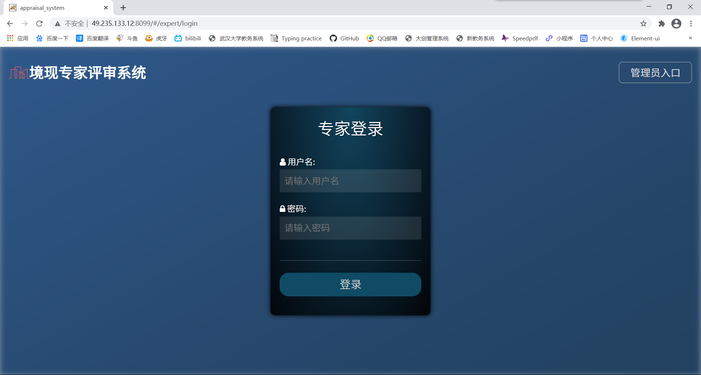

​	2、【首次登录】时需要完善信息（个人信息和评价指标），个人信息包括姓名、公司、职务、职称、电话、邮箱。

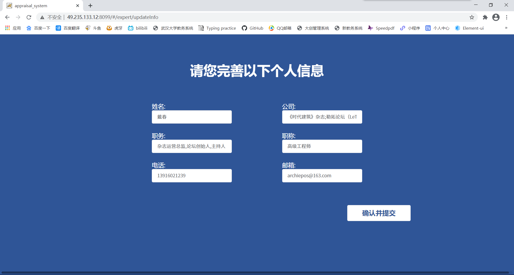

​	指标信息用于参评项目最终得分的计算。

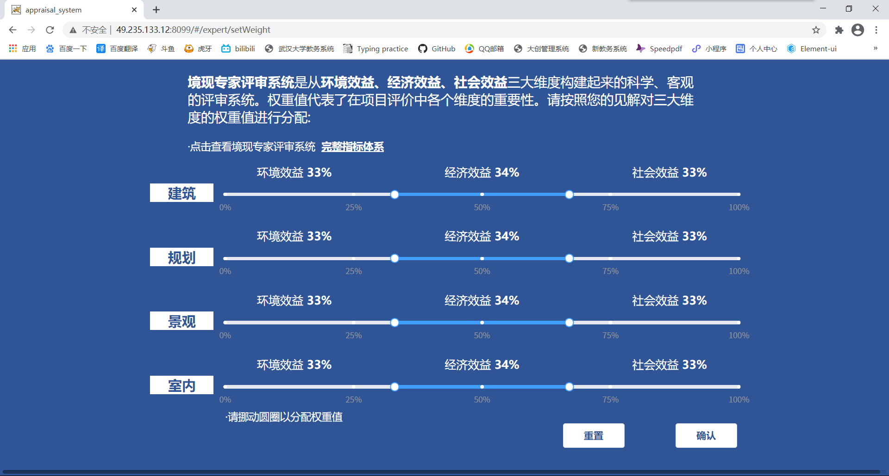

3.登录后进入评审阶段选择（初评和会评）

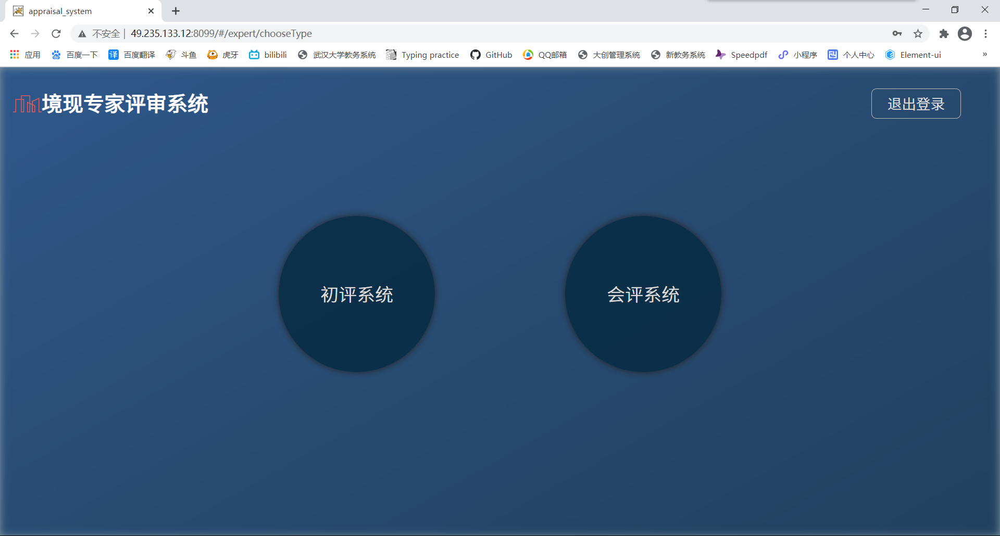

4.初评系统

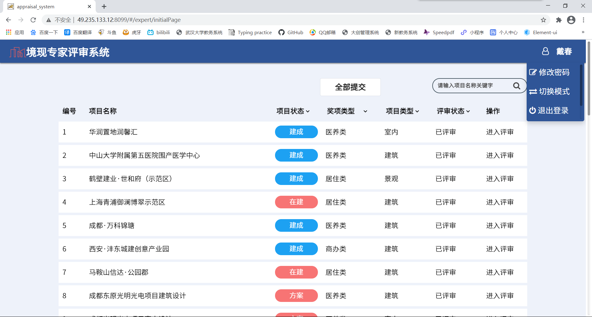

5.评分列表

点击页面右下角的【评分列表】按钮弹出项目评分列表。列表中包含该专家需要评审的所有项目，评审过的项目会显示具体分数。并且点击某一行可以跳转到对应的项目。

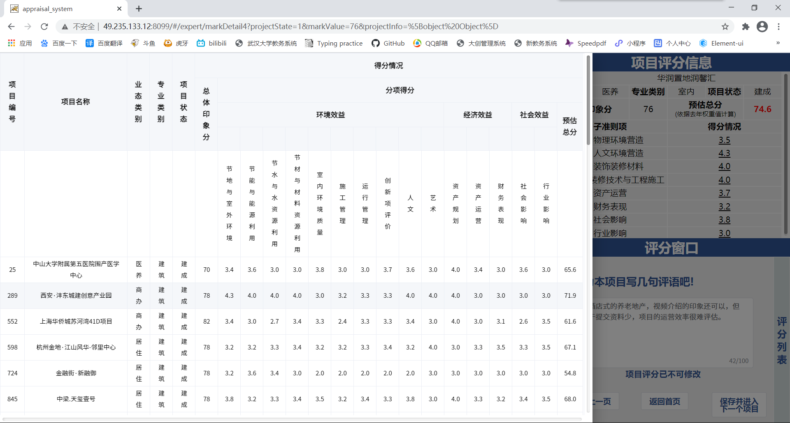

6.会评系统

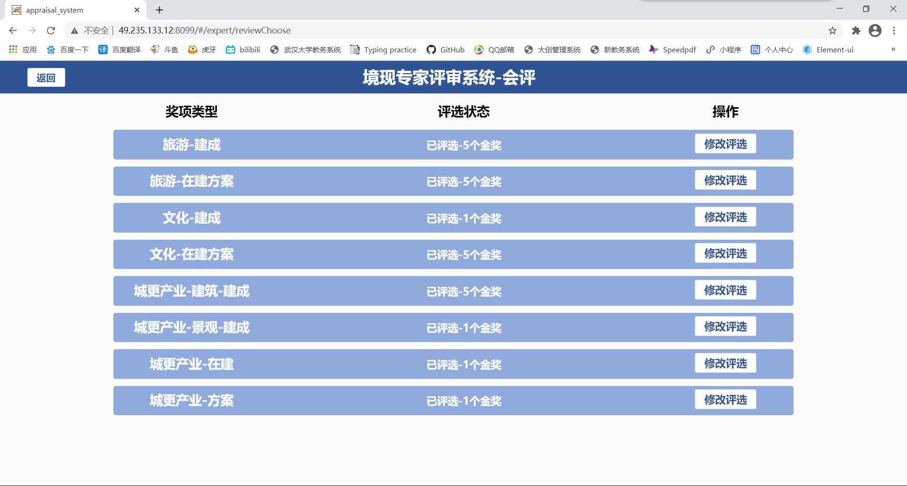

7.项目选择界面

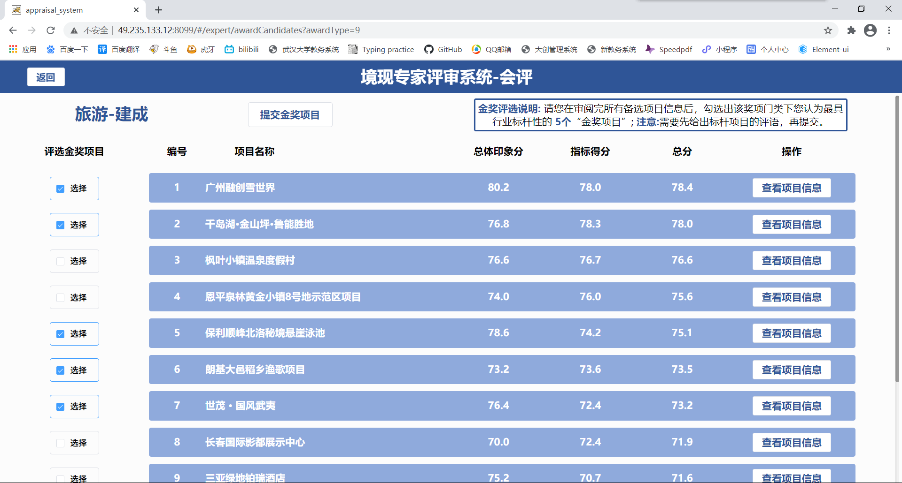

8.项目信息页面
项目信息页面所展示的内容基于各项目的初评得分。
页面右上为项目总体得分以及详细得分的雷达图，页面右下角为评语窗口。

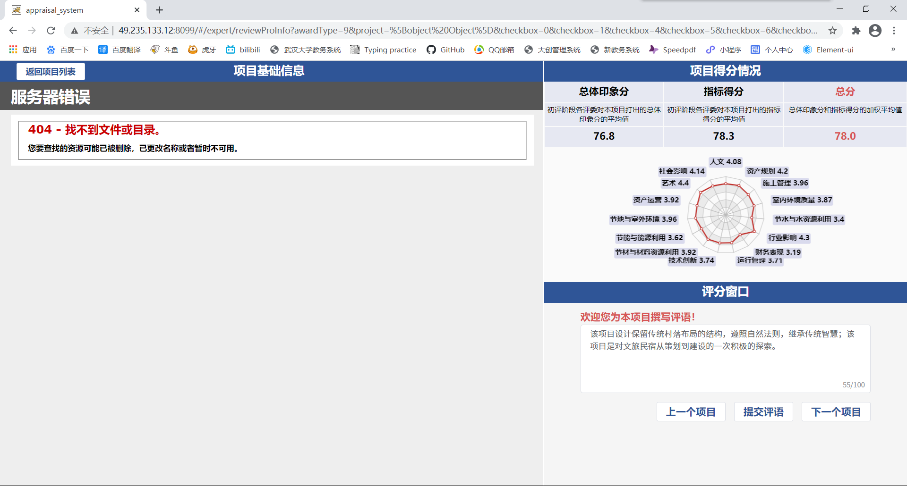

### 3.2、管理员部分

1.项目列表页面，展示了所有项目的各项信息。

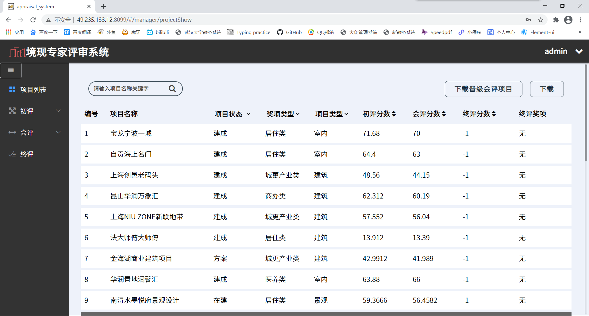

2.初评-专家分配页面
为专家分配初评项目，可以自动分配（每位专家按要求随机分配一瓶数目），也可以手动分配。

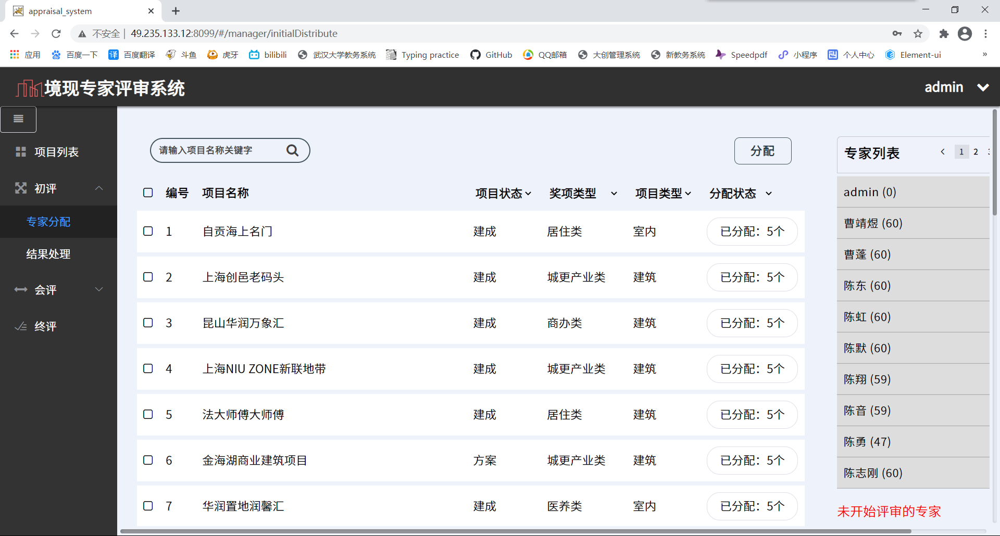

3.初评-结果处理页面

根据初评得分导出进入会评的所有项目。

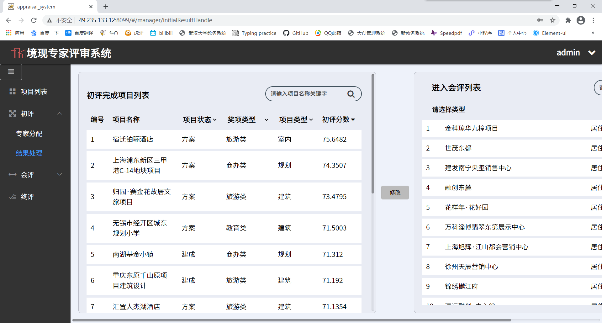

4.会评-专家分配页面

与初评功能类似，可以为专家分配会评项目，并显示专家的评审状态。

5.会评-结果处理界面

根据会评结果导出最终获奖项目。

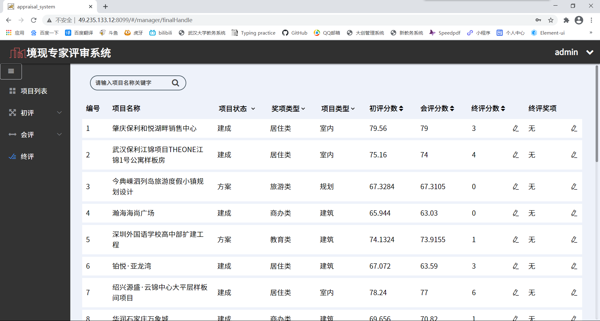

## 四、用户界面更改和追加说明

### 4.1.更改说明

​		更改用户界面设计时应该征得所有开发者得同意，所有开发者应按更正后的原则修改和设计用户界面。

#### 4.2.追加说明

​		追加本用户界面设计时应该发布给所有开发者，所有开发者应该按追加后原则修改和设计用户界面。

